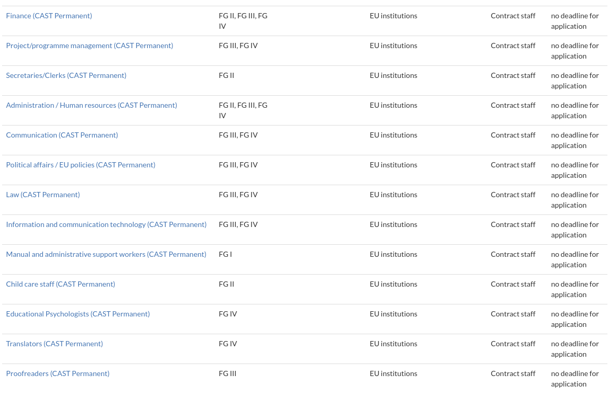
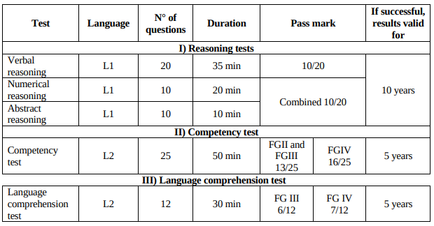

#  **EPSO CAST EXAM STEP BY STEP: How to get invited and how to succeed in the exam**

Sitting the EPSO CAST exam is one of the ways to get a job in the EU institutions. This article will try to bring some light and tips on how to improve your chances to get invited to sit the test and will explain how actually EPSO CAST process works and the steps that will follow until you get the expected job.

***Disclaimer:*** *The tips I will provide in this article are due to my own experience trying to understand better the EPSO processes and unblocking every step for many years (as a Blue Book trainee first, having passed both EPSO CAST LAW FGIII and FGIV and now working as an Interimaire for an EU body). There is of course official information out there and multiple forums on the different procedures, but I found lack of clarity in many steps and I wanted to write the type of article that would have been useful to me in my early days.*

### **Filling the form**  

The first thing you need to do if you want to have the chance to get invited to the test is to fill the corresponding form in [https://epso.europa.eu/]

You will find the job opportunities listed here: [https://epso.europa.eu/job-opportunities_en]

You then need to choose the EPSO CAST profile that is more according to your background and experience (you can fill more than one profile).  

 

You basically have all these different profiles. You see that the second column expresses FGI, FGII, FGIII & FGIV. That is because contract Agents are divided into four categories that correspond to different types of tasks and salaries.  

A good tip will be: fill all the categories that match your profile. If you go for CAST LAW for example, fill GFIII and FGIV. I saw many people wondering if they had just to fill FGIV because they already had several years of work experience. **In my experience, the truth is that: most positions will correspond to FGIII for budgetary reasons. The job in practice will be the same. Thus, filling both categories increase your chances to get invited to the test.**  

You can find the job descriptions here: [CAST CALL](https://epso.europa.eu/sites/epso/files/documents/casts/2017/epsocastp1-172017/cast-p-call-consolidated-version/en.pdf)

Filling the form will take some time. Here my tips will be to try to be specific to the job you want in the motivation questions and to introduce keywords. For instance, “AI”, “data protection”, etc. When a process is open, HR will probably look at the pool of CVs using keywords and therefore, your chances of being selected, increases.  

### **Waiting for the invitation to sit the test: ways to improve your chances to get invited**

If times pass and you don’t get an invitation, maybe is time to get closer to the Brussels environment. In my experience, being already based in Brussels increases your chances of being invited. Furthermore, having already work experience in an international organization is of course a plus. Trying to do an internship first in one of the EU institutions or bodies will probably help you to get invited.  

But of course, there is no guarantee. In my experience, I had both situations. I got invited to the CAST LAW FGIII quickly after filling the form, passed the test and then, did not pass the interview. After that, I got selected as Blue Book trainee in the European Commission and once I finished, I received another offer to sit to the CAST LAW FGIV.  

Therefore, it is not impossible to get invited before doing an internship, but if you are not, the best option to increase your chances will be to do an internship. Another misunderstanding is to think that is too late for you to apply for an internship. **The reality is that: the average age of being a Blue Book internship in my period was 27 years old.** And my experience makes me think that is better to do this internship once you have some work experience. Maybe you will think that you are overqualified for an internship, but that will increase you chances to get an actual position afterwards. I will talk about that option later.   

### **How to get prepared for the exam**

The exams take place every month (except in August), meaning that normally you have one month to prepare when you get an invitation. You will probably get an email, or a phone call and they will invite you to sit the test on the next test period. **You cannot change or postpone this invitation; therefore, you need to be prepared.** If you fail the exam, that is what will happen:

-  If you fail the reasoning tests, the recruiting services will not be able to invite you again for a test of the same or higher function group for the next 6 months.  
-  If you fail the competency test, the recruiting services will not be able to invite you for the test of the same or higher function group within the same profile for the next 6 months. Your scores in the reasoning tests will be retained.  

That means that you can start to get prepared for the exam if you know that there is some part of it especially difficult for you or, if you know that you won’t have plenty of time once you get the invitation because passing the exam is one unique opportunity.  

Passing the exam means that:

-  If you pass the reasoning tests, the results will remain valid for 10 years, for the same or lower function group(s).  
-  If you pass the competency tests, the results will remain valid for 5 years for the chosen profile in the same or lower function group(s).  

There are plenty of ways to get prepared for the exam. You can use eutraining.eu, the ORSEU books, the BANETH books, etc. In my experience I used eutraining.eu and BANETH book and both were ok. You only need one thing: practice, practice and practice.  

In the table below you find the scores you will need to get if you want to pass. **That is not a competition like AD5, thus, you only need a pass mark to get invited to the interview, Don’t worry if you don’t get a high mark, your goal here is to get the pass mark.**  

 

 

The reasoning part will be in your indicated language 1, normally your mother tongue. That is particularly useful for the verbal reasoning. Numerical and abstract are counted together, so you need a minimum 10 out of 20 of the two parts together.  

Competency part is the one that I found less information when I was preparing it. Here I have to say that the tests on eutraining.eu only gives you a taste on what topics to study, but you will need to complement it with your own study notes.  

For this part, I found useful the various Facebook groups that are available. For instance, EPSO CAST exams. There, with a simple search, you will find the type of competency questions relating your profile.

 

### **How to get prepared for the interview**

If you passed the test: CONGRATULATIONS!  

You will probably get an invitation for an interview in the following weeks. The structure of the interviews is usually similar. You will probably sit in front of a panel of 3 or 4 people (Head of Unit, HR and colleagues from the DG).  

The interviews are very structured, and you will get one or two questions from each of the persons on the panel. The advice here will be to get to know the files of the unit as best as possible. Study what they are working one, problems that are tackling, challenges, etc.  

You will get also a couple of working skills questions, like to put an example of how you work on a team or a difficult situation and what you learn about it, etc.

Another advice will be to expand on the answers. As I said, is a close structured interview, therefore, you may get follow up questions, but all the candidates will receive the same questions, so you need to expand your answers, or you will end up the interview quickly and without having explained the relevant points of your profile.

### **If the interview goes wrong, what’s next?**

If after all that process you, won’t get selected, don’t worry! You now have passed the CAST and the results of the reasoning test will be valid for 10 years and the ones for competency part for 5 years.

Relax, and your next step might be to send targeted emails to the Heads of Unit of the departments where you think your profile can be relevant. Contract Agent positions are normally not public; therefore, you need to be proactive.  

 Another parallel option can be to send your CV to the agencies recruiting *interimaires* for the EU institutions and bodies, for example, Randstad. You can find the contact [here](https://epso.europa.eu/how-to-apply_en#tab-0-5). These are short contracts but will help you to build your experience in the EU institutions and bodies and be aware of new opportunities.

Last, but not least: be patient and persistent!